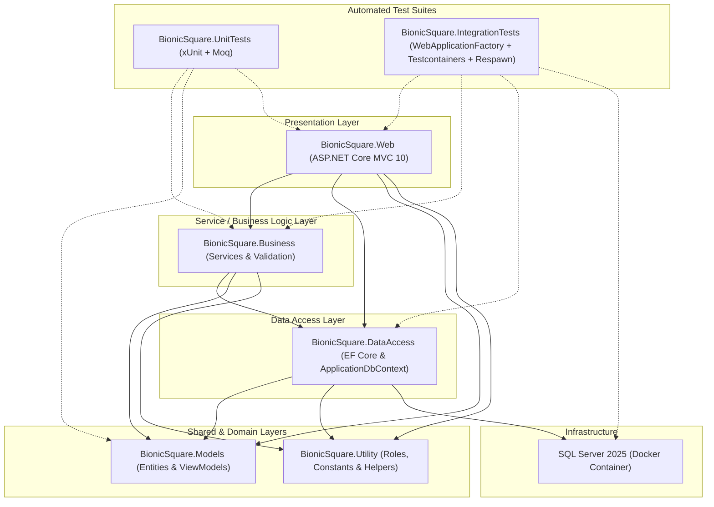
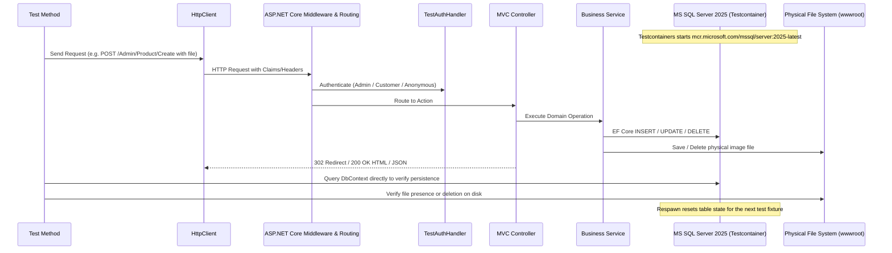

# BionicSquareBook

[](https://dotnet.microsoft.com/)
[](https://github.com/ibogatec/BionicSquareBook/actions/workflows/ci.yml)
[](https://github.com/ibogatec/BionicSquareBook/actions/workflows/codeql.yml)
[](https://docs.microsoft.com/ef/core/)
[](https://www.microsoft.com/sql-server)
[](https://getbootstrap.com/)
[](https://github.com/ibogatec/BionicSquareBook)
[](https://github.com)

**BionicSquareBook** is a modern, full-featured e-commerce bookstore web application built with **ASP.NET Core 10 MVC**, **Entity Framework Core 10**, and **SQL Server 2025**. It demonstrates an N-Tier layered architecture with separation of concerns across presentation, business logic, data access, and domain models, backed by an automated testing suite comprising unit tests and full-stack integration tests.

---

> [!WARNING]
> **Project Status: Under Active Development**
>
> This project is currently an ongoing work-in-progress. While core functionalities such as product & category management, role-based identity authentication, tiered pricing, and shopping cart management are functional, several key e-commerce features (e.g., checkout/payment processing via Stripe, order fulfillment workflow, and administrative analytics) are actively being developed. See the [Roadmap & Pending Features](#roadmap--pending-features) section for details.

---

## Table of Contents

- [Architecture Overview](#architecture-overview)
- [Project Structure](#project-structure)
- [Technology Stack](#technology-stack)
- [Key Features](#key-features)
  - [Current Implemented Features](#current-implemented-features)
  - [Roadmap & Pending Features](#roadmap--pending-features)
- [Prerequisites](#prerequisites)
- [Getting Started & Usage](#getting-started--usage)
  - [1. Clone Repository](#1-clone-repository)
  - [2. Configure SQL Server sa Password & Start Container](#2-configure-sql-server-sa-password--start-container)
  - [3. Configure Connection String](#3-configure-connection-string)
  - [4. Apply Database Migrations](#4-apply-database-migrations)
  - [5. Run the Application](#5-run-the-application)
- [Default Roles & Access Control](#default-roles--access-control)
- [REST API Endpoints](#rest-api-endpoints)
- [Testing & Code Coverage](#testing--code-coverage)
  - [Overview of Test Suites](#overview-of-test-suites)
  - [Integration Testing Architecture](#integration-testing-architecture)
  - [Running Unit Tests](#running-unit-tests)
  - [Running Integration Tests](#running-integration-tests)
  - [Running Tests with Code Coverage & Generating HTML Reports](#running-tests-with-code-coverage--generating-html-reports)
  - [Where Coverage Reports are Found](#where-coverage-reports-are-found)
  - [How to View and Read Code Coverage Reports](#how-to-view-and-read-code-coverage-reports)
  - [Coverage Settings & Exclusions](#coverage-settings--exclusions)
- [Contributing](#contributing)
- [License](#license)

---

## Architecture Overview

BionicSquareBook adheres to clean N-Tier layered architectural principles. Each project represents a specific layer with distinct responsibilities and unidirectional dependencies:



### Layer Responsibilities

1. **`BionicSquare.Web` (Presentation Layer)**:
   - ASP.NET Core 10 MVC application organized into MVC Areas (`Customer`, `Admin`, `Identity`).
   - Handles HTTP requests, view rendering (Razor), UI client scripts, and JSON API endpoints.
   - Configures authentication, authorization cookies, and dependency injection services in [`BionicSquare.Web/Program.cs`](file:///home/ivan/Examples/dotNET/BionicSquareBook/BionicSquare.Web/Program.cs).
   - Manages static assets including uploaded product images in `wwwroot/images/uploads/products`.

2. **`BionicSquare.Business` (Business Logic Layer)**:
   - Contains domain services and business interfaces ([`ICategoryServices`](file:///home/ivan/Examples/dotNET/BionicSquareBook/BionicSquare.Business/Services/ICategoryServices.cs), [`IProductServices`](file:///home/ivan/Examples/dotNET/BionicSquareBook/BionicSquare.Business/Services/IProductServices.cs), [`IShoppingCartService`](file:///home/ivan/Examples/dotNET/BionicSquareBook/BionicSquare.Business/Services/IShoppingCartService.cs), [`IApplicationUserService`](file:///home/ivan/Examples/dotNET/BionicSquareBook/BionicSquare.Business/Services/IApplicationUserService.cs)).
   - Enforces business rules (duplicate category validation, tiered product calculations, cart item adjustments, and file handling for image attachments).

3. **`BionicSquare.DataAccess` (Data Access Layer)**:
   - Entity Framework Core 10 database context ([`ApplicationDbContext`](file:///home/ivan/Examples/dotNET/BionicSquareBook/BionicSquare.DataAccess/ApplicationDbContext.cs)) inheriting from `IdentityDbContext<ApplicationUser>` directly mapped to SQL Server 2025.
   - Manages database relationships, foreign keys, table mapping, and initial seed data for categories and book catalog.
   - Hosts database migrations tracking schema evolution.

4. **`BionicSquare.Models` (Domain & ViewModel Layer)**:
   - Domain entities: [`Category`](file:///home/ivan/Examples/dotNET/BionicSquareBook/BionicSquare.Models/Category.cs), [`Product`](file:///home/ivan/Examples/dotNET/BionicSquareBook/BionicSquare.Models/Product.cs), [`ShoppingCart`](file:///home/ivan/Examples/dotNET/BionicSquareBook/BionicSquare.Models/ShoppingCart.cs), [`OrderHeader`](file:///home/ivan/Examples/dotNET/BionicSquareBook/BionicSquare.Models/OrderHeader.cs), [`OrderDetails`](file:///home/ivan/Examples/dotNET/BionicSquareBook/BionicSquare.Models/OrderDetails.cs), [`ApplicationUser`](file:///home/ivan/Examples/dotNET/BionicSquareBook/BionicSquare.Models/ApplicationUser.cs).
   - View models: [`ProductViewModel`](file:///home/ivan/Examples/dotNET/BionicSquareBook/BionicSquare.Models/ViewModels/ProductViewModel.cs), [`ShoppingCartViewModel`](file:///home/ivan/Examples/dotNET/BionicSquareBook/BionicSquare.Models/ViewModels/ShoppingCartViewModel.cs), [`LoginViewModel`](file:///home/ivan/Examples/dotNET/BionicSquareBook/BionicSquare.Models/ViewModels/LoginViewModel.cs), [`RegisterViewModel`](file:///home/ivan/Examples/dotNET/BionicSquareBook/BionicSquare.Models/ViewModels/RegisterViewModel.cs).

5. **`BionicSquare.Utility` (Shared Utilities)**:
   - Contains cross-cutting constants and helpers, such as role definitions ([`Role.cs`](file:///home/ivan/Examples/dotNET/BionicSquareBook/BionicSquare.Utility/Role.cs) with `Admin`, `Customer`, and `Employee`).

6. **`BionicSquare.UnitTests` (Unit Testing Suite)**:
   - Focused unit tests verifying domain calculations, view models, service validations, and isolated controller behaviors using `xUnit`, `Moq`, and `FluentAssertions`.

7. **`BionicSquare.IntegrationTests` (Integration Testing Suite)**:
   - End-to-end server integration tests verifying HTTP endpoints, routing, cookie/claims security, Razor view rendering, EF Core transactions, foreign key constraints, file system interactions, and database persistence against real Microsoft SQL Server 2025 Testcontainers.

8. **`BionicSquare.Data` (Infrastructure)**:
   - Contains [`BionicSquare.Data/docker-compose.yml`](file:///home/ivan/Examples/dotNET/BionicSquareBook/BionicSquare.Data/docker-compose.yml) and environment configurations to provision containerized Microsoft SQL Server 2025.

---

## Project Structure

```text
BionicSquareBook/
├── .github/                               # GitHub configurations and DevOps automation
│   ├── ISSUE_TEMPLATE/
│   │   ├── bug_report.md                  # Standardized bug reporting template
│   │   └── feature_request.md             # Feature request & enhancement proposal template
│   ├── workflows/
│   │   ├── ci.yml                         # GitHub Actions CI (Build, Unit & Integration Tests, Coverage Summary)
│   │   └── codeql.yml                     # CodeQL Static Application Security Testing (SAST)
│   ├── dependabot.yml                     # Dependabot configuration (NuGet & GitHub Actions updates)
│   └── PULL_REQUEST_TEMPLATE.md           # Engineering pull request quality checklist
│
├── .editorconfig                          # Code style and analyzer standards
│
├── BionicSquare.Business/                 # Business Logic Layer (Services & Validation)
│   ├── Services/
│   │   ├── ApplicationUserService.cs
│   │   ├── CategoryServices.cs
│   │   ├── ProductServices.cs
│   │   └── ShoppingCartService.cs
│   └── BionicSquare.Business.csproj
│
├── BionicSquare.Data/                     # Database container orchestration
│   ├── docker-compose.yml                 # SQL Server 2025 container specification
│   └── .env                               # Environment variables (MSSQL password)
│
├── BionicSquare.DataAccess/               # Data Access Layer
│   ├── ApplicationDbContext.cs            # EF Core DB context & model seeding
│   ├── Migrations/                        # EF Core database migrations
│   └── BionicSquare.DataAccess.csproj
│
├── BionicSquare.Models/                   # Domain Entities & ViewModels
│   ├── ApplicationUser.cs                 # Extended IdentityUser
│   ├── Category.cs
│   ├── Product.cs
│   ├── ShoppingCart.cs
│   ├── OrderHeader.cs
│   ├── OrderDetails.cs
│   ├── ViewModels/
│   └── BionicSquare.Models.csproj
│
├── BionicSquare.Utility/                  # Constants and Cross-cutting Utilities
│   ├── Role.cs                            # Role definitions (Admin, Customer, Employee)
│   └── BionicSquare.Utility.csproj
│
├── BionicSquare.Web/                      # ASP.NET Core 10 Presentation Layer
│   ├── Areas/
│   │   ├── Admin/                         # Admin controllers & views (Products, Categories, Dashboard)
│   │   ├── Customer/                      # Customer storefront (Home, Cart, Catalog)
│   │   └── Identity/                      # Authentication controllers (Login, Register, Logout)
│   ├── Views/Shared/                      # Shared layouts, partials & notifications
│   ├── wwwroot/                           # Static files (CSS, JS, product image uploads)
│   ├── Program.cs                         # App bootstrap, middleware pipeline & DI
│   ├── appsettings.json                   # Runtime configuration
│   └── BionicSquare.Web.csproj
│
├── BionicSquare.UnitTests/                # Unit Tests (Fast, Isolated, Moq + FluentAssertions)
│   ├── Controllers/
│   ├── Models/
│   ├── Services/
│   └── BionicSquare.UnitTests.csproj
│
├── BionicSquare.IntegrationTests/         # Integration Tests (Full Stack, Testcontainers, Respawn)
│   ├── Controllers/                       # Controller endpoint integration tests
│   ├── Infrastructure/                    # WebApplicationFactory, TestAuthHandler, AngleSharp helpers
│   ├── Services/                          # Real EF Core database persistence & interceptor tests
│   └── BionicSquare.IntegrationTests.csproj
│
├── coverlet.runsettings                   # Code coverage instrumentation configuration
├── run-unit-tests-with-coverage.sh        # Bash script: runs unit tests and generates coverage report
├── run-unit-tests-with-coverage.ps1       # PowerShell script: runs unit tests and generates coverage report
├── run-integration-tests-with-coverage.sh # Bash script: runs integration tests and generates coverage report
├── run-integration-tests-with-coverage.ps1# PowerShell script: runs integration tests and generates coverage report
├── BionicSquareBook.sln                   # Visual Studio / Rider Solution File
└── Readme.md                              # Project documentation
```

---

## Technology Stack

- **Framework**: [.NET 10.0](https://dotnet.microsoft.com/)
- **Web Layer**: ASP.NET Core MVC with Razor View Engine
- **ORM**: Entity Framework Core 10.0 (SQL Server provider, Tools, Design)
- **Database**: Microsoft SQL Server 2025 (via Docker)
- **Authentication / Security**: ASP.NET Core Identity with role-based authorization and Cookie Authentication
- **DevOps & CI/CD**:
  - GitHub Actions Continuous Integration (multi-stage build, test, and report summary)
  - GitHub CodeQL Static Application Security Testing (SAST)
  - Dependabot automated NuGet and Actions dependency updates
- **Front-end UI & Styling**:
  - Bootstrap 5.3.8 + Bootstrap Icons 1.13.1
  - Custom dark theme with vibrant emerald-green highlights (`#1DB954` / `#17A34A`)
  - DataTables 2.3.8 (client-side interactive table with AJAX)
  - SweetAlert2 (confirmation modals for destructive actions)
  - Toastr (asynchronous toast notifications)
  - jQuery 3.7.1 and unobtrusive validation
- **Testing & Quality Assurance**:
  - [xUnit](https://xunit.net/) test framework
  - [FluentAssertions](https://fluentassertions.com/) for expressive assertion syntax
  - [Moq](https://github.com/devlooped/moq) for isolating dependencies in unit tests
  - [ASP.NET Core WebApplicationFactory](https://learn.microsoft.com/aspnet/core/test/integration-tests) for in-memory HTTP server integration testing
  - [Testcontainers for .NET](https://dotnet.testcontainers.org/) for real containerized SQL Server 2025 instances
  - [Respawn](https://github.com/jbogard/Respawn) for fast database table reset between test fixtures
  - [AngleSharp](https://anglesharp.github.io/) for HTML DOM parsing and Razor UI assertions
  - [Coverlet](https://github.com/coverlet-coverage/coverlet) and [ReportGenerator](https://github.com/danielpalme/ReportGenerator) for code coverage analysis and HTML reporting

---

## Key Features

### Current Implemented Features

- [x] **Storefront & Catalog Browsing**:
  - Hero banner showcasing featured books and quick navigation.
  - Book catalog with cover thumbnails, category tags, author details, and list prices.
  - Product detail view displaying description, ISBN, category, and tiered bulk pricing.
- [x] **Tiered Quantity Pricing Model**:
  - Products support multi-tier discounts automatically calculated based on ordered quantities:
    - Base price (1–49 copies)
    - 50+ copies discount price (`Price50`)
    - 100+ copies discount price (`Price100`)
- [x] **Shopping Cart**:
  - Authenticated customers can add products with custom quantities.
  - Interactive cart review page with line-item totals and dynamic order subtotal calculations.
  - Real-time cart quantity modification via AJAX (`/api/cart/update`) and increment/decrement buttons.
  - Cart item count badge in top navigation bar.
- [x] **Product Management (Admin Area)**:
  - Full CRUD operations with category association dropdown.
  - Book cover upload and image file handling (saved with GUID to `wwwroot/images/uploads/products`).
  - Interactive DataTables view with instant search, pagination, sorting, and SweetAlert2-backed AJAX deletion.
- [x] **Category Management (Admin Area)**:
  - Full CRUD operations for product categories.
  - Display order specification.
  - Server-side validation ensuring uniqueness of category names.
- [x] **Authentication & Role-Based Authorization**:
  - Extended user profile (`ApplicationUser`) storing shipping address, city, state, postal code, and phone number.
  - Registration with automatic role assignment (`Customer`, `Admin`, `Employee`).
  - Cookie authentication with custom routes for login, logout, and access denied.
  - Protected admin routes restricted via `[Authorize(Roles = Role.Admin)]`.
- [x] **Automated Testing & Code Coverage Suite**:
  - Comprehensive unit tests covering business services, view models, and domain models.
  - Full-stack integration test suite with 100+ tests verifying controllers, authentication, authorization, database persistence, and file handling against live SQL Server 2025 Testcontainers.
  - Automated coverage collection and visual HTML reporting scripts.

---

### Roadmap & Pending Features

The following capabilities are planned or currently in development:

- [ ] **Checkout & Payment Gateway Integration**:
  - Wiring up checkout submission from the shopping cart.
  - Integration with Stripe (or equivalent payment gateway) using the existing `OrderHeader` fields (`SessionId`, `PaymentIntentId`).
- [ ] **Order Processing & Management Workflow**:
  - Administrative order management portal to review incoming orders.
  - Order status tracking (e.g., `Pending`, `Approved`, `Processing`, `Shipped`, `Cancelled`).
  - Carrier assignment and tracking number entry.
- [ ] **Admin Dashboard & Analytics**:
  - Expanding the admin dashboard from the current claims diagnostic view into a comprehensive analytics view (sales charts, order metrics, stock levels).
- [ ] **Customer Order History**:
  - Customer portal allowing users to review past orders, view receipts, and monitor shipment status.
- [ ] **Email Notifications**:
  - Email confirmation upon user registration and order placement receipts.

---

## Prerequisites

Before running the application or test suites, ensure the following are installed on your machine:

1. **[.NET 10 SDK](https://dotnet.microsoft.com/download/dotnet/10.0)** (or later)
2. **[Docker](https://docs.docker.com/get-docker/)** and **Docker Compose**
   - Required for local app development (SQL Server 2025 container).
   - Required for integration tests (Testcontainers automatically pulls and executes `mcr.microsoft.com/mssql/server:2025-latest`).
3. **[.NET EF CLI Tool](https://docs.microsoft.com/ef/core/cli/dotnet)**:
   ```bash
   dotnet tool install --global dotnet-ef
   ```
4. **[ReportGenerator Global Tool](https://github.com/danielpalme/ReportGenerator)** (installed automatically by coverage scripts):
   ```bash
   dotnet tool install --global dotnet-reportgenerator-globaltool
   ```

---

## Getting Started & Usage

### 1. Clone Repository

```bash
git clone https://github.com/ibogatec/BionicSquareBook.git
cd BionicSquareBook
```

### 2. Configure SQL Server `sa` Password & Start Container

The database runs in a Microsoft SQL Server 2025 Docker container defined in [`BionicSquare.Data/docker-compose.yml`](file:///home/ivan/Examples/dotNET/BionicSquareBook/BionicSquare.Data/docker-compose.yml). Before starting the container, choose one of the two options below to set your SQL Server system administrator (`sa`) password.

> [!IMPORTANT]
> Microsoft SQL Server enforces a strong password policy by default (at least 8 characters containing characters from three of the following four categories: uppercase letters, lowercase letters, numbers, and symbols).

#### Option A: Set via `.env` file (Recommended)

Edit or create the [`BionicSquare.Data/.env`](file:///home/ivan/Examples/dotNET/BionicSquareBook/BionicSquare.Data/.env) file:

```env
MSSQL_SA_PASSWORD=<your_strong_password>
```

The `docker-compose.yml` automatically reads `${MSSQL_SA_PASSWORD}` from this file.

#### Option B: Set directly in `docker-compose.yml`

Alternatively, set the password directly in the `environment` section of [`BionicSquare.Data/docker-compose.yml`](file:///home/ivan/Examples/dotNET/BionicSquareBook/BionicSquare.Data/docker-compose.yml):

```yaml
services:
    sqlserver:
        image: mcr.microsoft.com/mssql/server:2025-latest
        container_name: mssqlserver2025
        ports:
            - "1433:1433"
        environment:
            MSSQL_SA_PASSWORD: "<your_strong_password>"
            ACCEPT_EULA: "Y"
        volumes:
            - sql_data:/var/opt/mssql
        networks:
            - mssqlnet
```

#### Launch the SQL Server Container

Navigate to the `BionicSquare.Data` directory and start the container:

```bash
cd BionicSquare.Data
docker compose up -d
cd ..
```

This provisions Microsoft SQL Server running on port `localhost:1433`.

### 3. Configure Connection String

The application looks for a connection string named `MSSqlConn`. Configure it with the `sa` password chosen in Step 2. You can configure it using **.NET User Secrets** (recommended for local development) or via `appsettings.Development.json`.

#### Option A: Using .NET User Secrets (Recommended)

Run the following command from the repository root, substituting `<your_strong_password>` with the password you set in Step 2:

```bash
dotnet user-secrets set "ConnectionStrings:MSSqlConn" "Server=localhost,1433;Database=BionicSquareDb;User Id=sa;Password=<your_strong_password>;TrustServerCertificate=True;" --project BionicSquare.Web
```

#### Option B: Using `appsettings.Development.json`

Add the connection string to [`BionicSquare.Web/appsettings.Development.json`](file:///home/ivan/Examples/dotNET/BionicSquareBook/BionicSquare.Web/appsettings.Development.json):

```json
{
  "ConnectionStrings": {
    "MSSqlConn": "Server=localhost,1433;Database=BionicSquareDb;User Id=sa;Password=<your_strong_password>;TrustServerCertificate=True;"
  },
  "Logging": {
    "LogLevel": {
      "Default": "Information",
      "Microsoft.AspNetCore": "Warning"
    }
  }
}
```

### 4. Apply Database Migrations

Apply the Entity Framework Core migrations to create the database schema and populate seed data:

```bash
dotnet ef database update --project BionicSquare.DataAccess --startup-project BionicSquare.Web
```

This will automatically create the database (`BionicSquareDb`), generate the tables (`Categories`, `Products`, `ShoppingCarts`, `OrderHeaders`, `OrderDetails`, `AspNetUsers`, etc.), and seed initial categories and sample books.

### 5. Run the Application

Start the web application using the `dotnet run` command:

```bash
dotnet run --project BionicSquare.Web
```

The application will launch on:
- **HTTPS**: `https://localhost:7097`
- **HTTP**: `http://localhost:5170`

Open your browser and navigate to `https://localhost:7097`.

---

## Default Roles & Access Control

The application implements three primary roles defined in [`Role.cs`](file:///home/ivan/Examples/dotNET/BionicSquareBook/BionicSquare.Utility/Role.cs):

| Role | Access Level | Description |
| :--- | :--- | :--- |
| **`Admin`** | Full Access | Can manage Categories, Products, view the Admin Portal, and manage future orders. |
| **`Employee`** | Staff Access | Can access the Admin Portal and perform authorized inventory operations. |
| **`Customer`** | Storefront | Can browse books, add items to cart, and proceed to checkout. |

### Testing Different Roles

1. Click **Register** on the top navigation bar.
2. Fill in the user details and select the desired role (`Admin`, `Customer`, or `Employee`) from the dropdown.
3. Once registered as an **Admin**, an **Admin Portal** link will appear in the navigation bar leading to:
   - Category Management: `/Admin/Category`
   - Product Management: `/Admin/Product`
   - Admin Dashboard: `/Admin/Dashboard`

---

## REST API Endpoints

The web application exposes lightweight JSON endpoints consumed by client-side scripts:

| HTTP Method | Endpoint | Description | Authorization |
| :--- | :--- | :--- | :--- |
| `GET` | `/api/products` | Returns all products with category details for DataTables | Public |
| `DELETE` | `/api/products/delete?id={id}` | Deletes a product and its associated image file | Admin |
| `POST` | `/api/cart/update?cartId={id}&quantity={qty}` | Updates the quantity of an item in the user's cart | Authenticated |

---

## Testing & Code Coverage

BionicSquareBook features a dual-layer testing strategy designed to ensure both rapid feedback during development and rock-solid validation across the entire request-response pipeline.

### Overview of Test Suites

| Test Project | Technology Stack | Scope & Purpose | Speed |
| :--- | :--- | :--- | :--- |
| **`BionicSquare.UnitTests`** | xUnit, Moq, FluentAssertions | Isolated unit testing of business logic, models, view models, and controller branches using mocked dependencies. | Very Fast (< 2s) |
| **`BionicSquare.IntegrationTests`** | xUnit, ASP.NET Core `WebApplicationFactory`, `Testcontainers.MsSql`, `Respawn`, `AngleSharp` | Full-stack server integration testing against a live SQL Server 2025 container. Tests authentication cookies, authorization policies, middleware, model binding, EF Core persistence, transactions, file uploads, and Razor view rendering. | ~5–10s |

---

### Integration Testing Architecture

The integration testing suite runs in an isolated, production-like environment configured in [`CustomWebApplicationFactory.cs`](file:///home/ivan/Examples/dotNET/BionicSquareBook/BionicSquare.IntegrationTests/Infrastructure/CustomWebApplicationFactory.cs):



Key integration test infrastructure components:
- **`CustomWebApplicationFactory`**: Bootstraps the application in-memory, launches a dynamic `Testcontainers.MsSql` container, applies EF Core migrations, seeds identity roles, and initializes a `Respawn` checkpoint.
- **`Respawn` Database Resetting**: Fast checkpoint-based reset between test fixtures without dropping and recreating the database or restarting containers.
- **`TestAuthHandler` & `HttpClientExtensions`**: Intercepts HTTP requests to support seamless authentication testing across roles:
  - `Client.AsAnonymous()`: Tests unauthenticated scenarios, login redirections, and public pages.
  - `Client.WithUser(userId)`: Tests authenticated customer user actions (shopping cart, account details).
  - `Client.WithAdmin(adminId)`: Tests admin-protected routes and role-based policies.
- **`TestAntiforgery`**: Bypasses CSRF token validation during testing while keeping controller `[ValidateAntiForgeryToken]` attributes active in production.
- **`AngleSharp` (`HtmlHelpers`)**: Parses server-rendered Razor HTML into an in-memory DOM to assert inputs, forms, and validation error messages.

---

### Running Unit Tests

#### Quick Execution via .NET CLI

To execute only the unit tests from the terminal:

```bash
dotnet test BionicSquare.UnitTests/BionicSquare.UnitTests.csproj
```

---

### Running Integration Tests

#### Prerequisites
Ensure Docker is running on your machine. Testcontainers will automatically pull and start the Microsoft SQL Server 2025 image (`mcr.microsoft.com/mssql/server:2025-latest`) during test execution.

#### Quick Execution via .NET CLI

To execute all integration tests:

```bash
dotnet test BionicSquare.IntegrationTests/BionicSquare.IntegrationTests.csproj
```

---

### Running Tests with Code Coverage & Generating HTML Reports

Dedicated shell and PowerShell scripts are provided at the root of the repository. Each script:
1. Cleans up previous test results (`./TestResults`) and coverage reports (`./CoverageReport`).
2. Checks for and installs `dotnet-reportgenerator-globaltool` if not already present.
3. Executes the target test project with Coverlet code coverage collection and the solution's [`coverlet.runsettings`](file:///home/ivan/Examples/dotNET/BionicSquareBook/coverlet.runsettings).
4. Generates a standalone, visual HTML coverage report using ReportGenerator.

#### For Unit Tests

- **Linux / macOS**:
  ```bash
  ./run-unit-tests-with-coverage.sh
  ```
- **Windows (PowerShell)**:
  ```powershell
  .\run-unit-tests-with-coverage.ps1
  ```

#### For Integration Tests

- **Linux / macOS**:
  ```bash
  ./run-integration-tests-with-coverage.sh
  ```
- **Windows (PowerShell)**:
  ```powershell
  .\run-integration-tests-with-coverage.ps1
  ```

---

### Where Coverage Reports are Found

After running either coverage script, the output files are placed in standard directories:

| Output | Path | Format & Purpose |
| :--- | :--- | :--- |
| **HTML Report (Visual)** | `CoverageReport/index.html` | Interactive, navigable visual coverage dashboard displaying line-by-line coverage and source code highlighting. |
| **Raw Cobertura XML** | `TestResults/<guid>/coverage.cobertura.xml` | Machine-readable coverage XML suitable for CI/CD pipelines (e.g., GitHub Actions, Azure Pipelines, SonarQube). |

---

### How to View and Read Code Coverage Reports

#### 1. Viewing the Report in a Web Browser

You can open the report directly using your default browser:

- **Linux**:
  ```bash
  xdg-open CoverageReport/index.html
  ```
- **macOS**:
  ```bash
  open CoverageReport/index.html
  ```
- **Windows**:
  ```powershell
  start CoverageReport/index.html
  ```

#### 2. Viewing via a Local HTTP Server (e.g., Live Server)

If you use VS Code / Cursor or prefer a local web server:
- With the **Live Server** extension: Right-click `CoverageReport/index.html` and select **Open with Live Server** (default URL: `http://127.0.0.1:5500/CoverageReport/index.html`).
- With Python:
  ```bash
  python3 -m http.server 5500
  ```
  Then open `http://127.0.0.1:5500/CoverageReport/index.html` in your browser.

#### 3. Understanding Coverage Metrics & Indicators

When reviewing the HTML report:

- **Line / Sequence Coverage**: Measures the percentage of executable C# code statements traversed during the test run.
- **Branch Coverage**: Measures the percentage of decision pathways (such as `if`/`else` branches, ternary expressions `? :`, null-coalescing operators `??`, and switch expressions) exercised during tests.
- **Source Code Line Color Codes**:
  - 🟩 **Green**: Line was fully executed by test cases.
  - 🟥 **Red**: Line was not executed (uncovered code path).
  - 🟧 **Yellow / Orange**: Partially covered branch (e.g. an `if` condition was evaluated as `true`, but the `false` branch was never exercised).
- **Collapsible Breakdown**: Click on any assembly, namespace, or class (e.g., `BionicSquare.Business_ProductServices.html`) to inspect line-by-line coverage directly alongside source code.

---

### Coverage Settings & Exclusions

Coverage collection is governed by [`coverlet.runsettings`](file:///home/ivan/Examples/dotNET/BionicSquareBook/coverlet.runsettings). To ensure the coverage metrics accurately represent meaningful business and application logic, non-actionable code is intentionally excluded:

```xml
<Configuration>
  <DataCollectors>
    <DataCollector friendlyName="XPlat Code Coverage">
      <Configuration>
        <Format>cobertura</Format>
        <Exclude>[BionicSquare.UnitTests]*,[BionicSquare.IntegrationTests]*,[*]*.Migrations.*</Exclude>
        <ExcludeByAttribute>Obsolete,GeneratedCodeAttribute,CompilerGeneratedAttribute</ExcludeByAttribute>
        <ExcludeByFile>**/Program.cs,**/Migrations/*.cs</ExcludeByFile>
      </Configuration>
    </DataCollector>
  </DataCollectors>
</Configuration>
```

- **Excluded**: Test assemblies, auto-generated EF Core database migrations, compiler-generated closures, and boilerplate bootstrap files.
- **Included**: All production business services (`BionicSquare.Business`), data access repositories (`BionicSquare.DataAccess`), domain models (`BionicSquare.Models`), controllers, and presentation logic (`BionicSquare.Web`).

---

## Contributing

1. Fork the repository.
2. Create a descriptive feature branch (`git checkout -b feature/awesome-feature`).
3. Commit your changes (`git commit -m "Add awesome feature"`).
4. Push to the branch (`git push origin feature/awesome-feature`).
5. Open a Pull Request.

---

## License

This project is licensed under the MIT License - see the repository LICENSE file for details.
